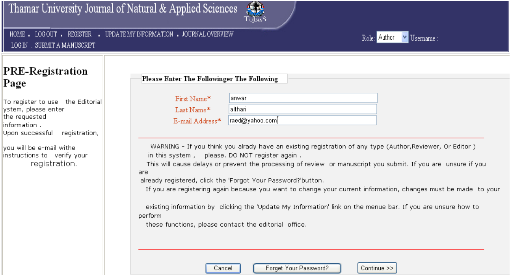
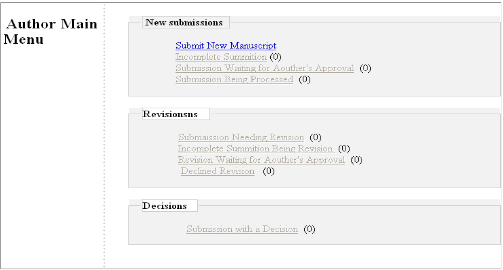

# What is SciRMang?

    This system considers arbitration and research management systems, where this system develops 
    the education process and introduces many services and facilities for the persons 
    and organizations that specialize in this field. 
    Also, this system was designed according to international specifications that are 
    applied in most international Journals.  
   
    This project has been developed using suitable software tools. Based on our preliminary 
    investigation, we found that the language of ASP.NET(Active Server Page) 
    and connected between the Data Base SQL Server, which is one of the best languages for 
    setting up and developing the website.
   
    By applying this system. It offers benefits such as exploitation time, effort, and cost 
    and facilitates communication among the parties of the journal editors, reviewers, authors, 
    and journal management. Moreover, It is Easy to add the journal to the list of international journals. 
    The remote conferences, Books, and publications system does not support it.
   
    After building and implementing the system, the system can be applied to any Journal specializing 
    in publishing research.


```
** We used ASP.NET, which is ASP.NET is a web application framework developed by Microsoft
for building dynamic web pages and web applications.
It allows developers to create websites, web services,
and web applications using a variety of programming languages such as C#, Visual Basic, and F#..**
## Requirements
**ASP.NET**
**CSS**
**Java Script**
**JQuery**
**Bootstrap**
**Data Base SQL Server**
```
# page

<br>
<div align=left>  </div>
<br>
<div align=left>  </div>
<br>
<div align=left>  </div>

# How does it work?

For more information about SciRMang, Please read chapters in documentation 0.1  <a href="documentation 0.1">here</a>. 
